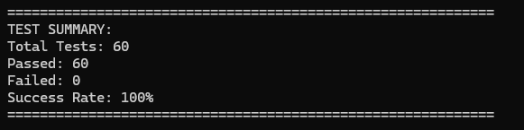

# Doubly Linked List Implementation in C++

[](https://isocpp.org/)
[](https://opensource.org/licenses/MIT)
[](https://github.com/yourusername/doubly-linked-list)
[](https://github.com/yourusername/doubly-linked-list)

A comprehensive, production-ready doubly linked list implementation in C++ with extensive debugging capabilities, advanced manipulation functions, and a complete test suite.

## 🚀 Features

### Core Operations
- **Insertion**: Front, end, and sorted insertion
- **Deletion**: Front, end, key-based, and position-based deletion
- **Traversal**: Forward and backward iteration
- **Search**: Efficient node access by position

### Advanced Functionality
- **List Analysis**: Palindrome detection, middle element finding
- **List Manipulation**: Reversal, node swapping, sorted list merging
- **Memory Management**: Automatic cleanup with destructor
- **Debug Support**: Comprehensive integrity checking and visualization

### Professional Features
- **Extensive Documentation**: Doxygen-compatible comments
- **Comprehensive Testing**: 60+ test cases with 100% pass rate
- **Memory Safety**: Proper resource management and leak prevention
- **Error Handling**: Robust handling of edge cases and invalid operations

## 📋 Test Results

Our implementation passes all professional test cases with 100% success rate:



*Complete test suite covering edge cases, boundary conditions, and performance scenarios*

## 🏗️ Architecture

### Class Structure
```cpp
class LinkedList {
private:
    Node* head{};           // Pointer to first node
    Node* tail{};           // Pointer to last node
    int length = 0;         // Current list size
    vector<Node*> debug_data; // Debug tracking vector

public:
    // 25+ public methods for comprehensive list operations
};

struct Node {
    int data{};             // Node data
    Node* next{};           // Forward pointer
    Node* prev{};           // Backward pointer
};
```

## 🛠️ Installation & Usage

### Prerequisites
- C++ compiler with C++11 support or later
- Visual Studio (optional, project files included)
- Make or any build system (optional, for build automation)

### Quick Start
```cpp
#include "DoublyLinkedList.h"

int main() {
    LinkedList list;
    
    // Basic operations
    list.insert_end(10);
    list.insert_front(5);
    list.insert_sorted(7);
    
    // Display
    list.print();           // Output: 5 7 10
    list.print_reverse();   // Output: 10 7 5
    
    // Advanced operations
    bool isPalindrome = list.is_palindrome();
    int middle = list.find_the_middle1();
    list.reverse();
    
    return 0;
}
```

### Compilation
```bash
# Command Line Compilation
# Compile the library
g++ -c DoublyLinkedList.cpp Node.cpp

# Compile with your application
g++ -o your_app your_app.cpp DoublyLinkedList.cpp Node.cpp

# Run the comprehensive test suite
g++ -o test_suite Source.cpp DoublyLinkedList.cpp Node.cpp
./test_suite

# Visual Studio
# Open Doubly_Llinked_List.vcxproj in Visual Studio
# Build and run directly from the IDE
```

## 📚 API Reference

### Insertion Operations
| Method | Description | Complexity |
|--------|-------------|------------|
| `insert_front(val)` | Insert at beginning | O(1) |
| `insert_end(val)` | Insert at end | O(1) |
| `insert_sorted(val)` | Insert in sorted order | O(n) |

### Deletion Operations
| Method | Description | Complexity |
|--------|-------------|------------|
| `delete_front()` | Delete first node | O(1) |
| `delete_end()` | Delete last node | O(1) |
| `delete_node_with_key(val)` | Delete first occurrence | O(n) |
| `delete_all_nodes_with_key(val)` | Delete all occurrences | O(n) |
| `delete_even_positions()` | Delete nodes at even positions | O(n) |
| `delete_odd_positions()` | Delete nodes at odd positions | O(n) |

### Analysis Operations
| Method | Description | Complexity |
|--------|-------------|------------|
| `is_palindrome()` | Check if list is palindrome | O(n) |
| `find_the_middle1()` | Find middle (two-pointer) | O(n) |
| `find_the_middle2()` | Find middle (tortoise-hare) | O(n) |

### Advanced Operations
| Method | Description | Complexity |
|--------|-------------|------------|
| `reverse()` | Reverse entire list | O(n) |
| `swap_kth(k)` | Swap kth from start/end | O(n) |
| `merge_2sorted_lists(other)` | Merge two sorted lists | O(n+m) |

### Access Operations
| Method | Description | Complexity |
|--------|-------------|------------|
| `get_nth_node(n)` | Get nth node from start | O(n) |
| `get_nth_node_back(n)` | Get nth node from end | O(n) |

## 🧪 Testing

### Test Coverage
Our comprehensive test suite includes:

- **60+ Test Cases** across 7 categories
- **Edge Case Testing**: Empty lists, single elements, large datasets
- **Boundary Testing**: Out-of-bounds access, invalid operations  
- **Performance Testing**: 1000+ element operations
- **Memory Testing**: Proper cleanup and leak prevention
- **Algorithm Testing**: Multiple implementation approaches

### Test Categories
1. **Constructor & Destructor Tests** - Memory management
2. **Insertion Tests** - All insertion methods and edge cases
3. **Deletion Tests** - All deletion methods and special cases
4. **Analysis Tests** - Palindrome and middle-finding algorithms
5. **Access Tests** - Node retrieval and boundary checking
6. **Manipulation Tests** - Reverse, swap, and merge operations
7. **Edge Cases** - Single elements, large lists, negative numbers

### Running Tests
```bash
# Compile and run the test suite (located in Source.cpp)
g++ -o test_suite Source.cpp DoublyLinkedList.cpp Node.cpp
./test_suite

# Expected output: 100% pass rate across all categories
# See test_results.png for actual execution screenshot
```

## 🔧 Debug Features

### Comprehensive Debugging
- **Integrity Verification**: Automatic structure validation
- **Memory Tracking**: Debug vector for all node operations
- **Visualization**: Node relationship printing
- **Address Inspection**: Memory address debugging
- **String Conversion**: Easy list content verification

### Debug Methods
```cpp
// Verify list integrity
list.debug_verfiy_data_integrity();

// Print list structure
list.debug_print_list("Current State:");

// Convert to string for testing
string content = list.debug_to_string();

// Print memory addresses
list.debuge_print_address();
```

## 📁 Project Structure
```
doubly-linked-list/
├── DoublyLinkedList.h                    # Main class header with comprehensive documentation
├── DoublyLinkedList.cpp                  # Complete implementation with detailed comments
├── Node.h                                # Node structure header file
├── Node.cpp                              # Node implementation
├── Source.cpp                            # Comprehensive test suite (60+ test cases)
├── README.md                             # Project documentation (this file)
├── test_results.png                      # Test execution screenshot showing 100% pass rate
├── Doubly_Llinked_List.vcxproj          # Visual Studio project file
└── Doubly_Llinked_List.vcxproj.filters  # Visual Studio project filters
```

## 🎯 Use Cases

### Educational
- **Data Structures Course**: Complete implementation with explanations
- **Algorithm Study**: Multiple approaches to common problems
- **Code Review Practice**: Professional coding standards example

### Professional Development
- **Interview Preparation**: Common data structure questions
- **Code Portfolio**: Demonstrates C++ proficiency
- **Best Practices**: Memory management and testing examples

### Production Applications
- **Music Playlist**: Previous/next track navigation
- **Undo/Redo Systems**: Bidirectional operation history
- **Browser History**: Forward and backward navigation
- **Text Editors**: Cursor movement and text manipulation

## 🚀 Performance Characteristics

| Operation | Time Complexity | Space Complexity |
|-----------|----------------|------------------|
| Insertion (front/end) | O(1) | O(1) |
| Insertion (sorted) | O(n) | O(1) |
| Deletion (front/end) | O(1) | O(1) |
| Search | O(n) | O(1) |
| Traversal | O(n) | O(1) |
| Reverse | O(n) | O(1) |
| Merge | O(n+m) | O(1) |

## 🤝 Contributing

Contributions are welcome! Please feel free to submit pull requests or open issues for:
- Bug fixes
- Performance improvements  
- Additional functionality
- Test case enhancements
- Documentation improvements

### Development Guidelines
1. Follow existing code style and documentation standards
2. Add comprehensive test cases for new features
3. Ensure all tests pass before submitting
4. Update documentation for API changes

## 📄 License

This project is licensed under the MIT License - see the [LICENSE](LICENSE) file for details.

## 📞 Contact

- **Author**: Fathy Ahmed Fathy
- **Email**: fathy2004713@gmail.com
- **GitHub**: [@Fathy-Ahmed](https://github.com/Fathy-Ahmed)
- **LinkedIn**: [fathy-ahmed1](https://linkedin.com/in/fathy-ahmed1/)

## ⭐ Acknowledgments

- Inspired by classic data structure implementations
- Test framework design influenced by modern testing practices
- Documentation follows industry-standard patterns

---

**⭐ If you found this implementation helpful, please consider giving it a star!**
