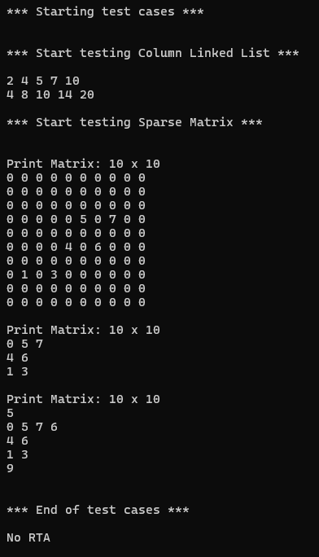

# Sparse Matrix Implementation using Nested Doubly Linked Lists

A highly memory-efficient C++ implementation of sparse matrices using a nested doubly linked list structure. This implementation builds upon the sparse array concept to create a two-dimensional sparse data structure optimized for matrices where most elements are zero.

## Overview

Traditional 2D arrays allocate memory for every matrix element, which becomes wasteful for sparse matrices common in scientific computing, graph algorithms, and optimization problems. This sparse matrix implementation uses a hierarchical approach with doubly linked lists to store only non-zero values, achieving significant memory savings.

## Architecture

The sparse matrix uses a **nested doubly linked list structure**:

- **Row Level**: A doubly linked list of `RowNode` objects, each representing a row with non-zero elements
- **Column Level**: Each `RowNode` contains a `ColumnLinkedList` that stores non-zero elements within that row
- **Hierarchical Storage**: Only rows and columns with non-zero values are stored in memory

### Component Hierarchy

```
SparseMatrix
├── RowNode (Doubly Linked List)
│   ├── ColumnLinkedList (Sparse Row Implementation)
│   │   └── ColumnNode (Doubly Linked List)
│   └── Row Metadata
└── Matrix Dimensions & Operations
```

## Key Features

- **Memory Efficient**: Only stores non-zero matrix elements
- **Hierarchical Design**: Two-level sparse structure for optimal memory usage
- **Dynamic Operations**: Support for setting values, getting values, and matrix addition
- **Sorted Storage**: Both rows and columns maintain sorted order for efficient access
- **Sentinel Nodes**: Uses sentinel nodes at both row and column levels for simplified operations
- **Flexible Dimensions**: Supports matrices of any size with automatic memory management

## File Structure

```
├── ColumnNode.h         # Column node structure
├── ColumnLinkedList.h   # Column-level sparse array declaration  
├── ColumnLinkedList.cpp # Column-level sparse array implementation
├── RowNode.h           # Row node structure containing column list
├── SparseMatrix.h      # Main sparse matrix class declaration
├── SparseMatrix.cpp    # Sparse matrix implementation
└── Source.cpp          # Test cases and demonstrations
```

## Core Components

### ColumnNode
```cpp
struct ColumnNode {
    int data{};      // Element value
    int column{};    // Column index
    ColumnNode* next{};
    ColumnNode* prev{};
};
```

### ColumnLinkedList
Manages a sparse row using doubly linked list of column nodes:
- `set_value(data, col)`: Set value at specific column
- `get_value(col)`: Retrieve value (returns 0 if not stored)
- `add(other)`: Add corresponding elements from another row

### RowNode
```cpp
struct RowNode {
    int row{};              // Row index
    ColumnLinkedList col_list; // Sparse columns for this row
    RowNode* next{};
    RowNode* prev{};
};
```

### SparseMatrix
Main class providing matrix operations:
- `set_value(data, row, col)`: Set matrix element
- `get_value(row, col)`: Get matrix element (returns 0 if not stored)
- `add(other_matrix)`: Matrix addition
- `print_matrix()`: Display full matrix including zeros
- `print_matrix_nonzero()`: Display only non-zero elements by row

## Usage Example

```cpp
#include "SparseMatrix.h"

// Create 10x10 sparse matrix
SparseMatrix matrix(10, 10);

// Set sparse values
matrix.set_value(5, 3, 5);  // Set element at row 3, column 5 to value 5
matrix.set_value(7, 3, 7);  // Set element at row 3, column 7 to value 7
matrix.set_value(6, 5, 6);  // Set element at row 5, column 6 to value 6

// Print full matrix (including zeros)
matrix.print_matrix();

// Print only non-zero elements
matrix.print_matrix_nonzero();

// Matrix addition
SparseMatrix matrix2(10, 10);
matrix2.set_value(8, 3, 6);  // Add to existing element
matrix.add(matrix2);
```

## Test Output

The following demonstrates the sparse matrix functionality with both column list testing and full matrix operations:



### Test Breakdown:

1. **Column Linked List Test**: 
   - Creates a sparse row with values [2, 4, 5, 7, 10]
   - Demonstrates row addition (doubling values)

2. **Sparse Matrix Test**:
   - Creates a 10×10 matrix with scattered non-zero values
   - Shows full matrix representation with zeros
   - Displays compact non-zero representation
   - Demonstrates matrix addition with element combination

## Performance Analysis

### Time Complexity
- **Set Value**: O(r + c) where r is non-zero rows before target row, c is non-zero columns before target column
- **Get Value**: O(r + c) for the same traversal requirements
- **Matrix Addition**: O(n + m) where n and m are total non-zero elements in each matrix
- **Print Full Matrix**: O(rows × cols) for complete matrix display
- **Print Non-Zero**: O(k) where k is the number of non-zero elements

### Space Complexity
- **Memory Usage**: O(k) where k is the number of non-zero elements
- **Overhead**: Minimal pointer overhead per stored element
- **Savings**: Dramatic reduction for highly sparse matrices (>90% zeros)

## Compilation

```bash
g++ -o sparse_matrix Source.cpp SparseMatrix.cpp ColumnLinkedList.cpp
./sparse_matrix
```

## Requirements

- C++11 or later
- Standard library support for `<iostream>` and `<cassert>`

## Ideal Use Cases

This sparse matrix implementation excels in:

- **Scientific Computing**: Large sparse systems in numerical analysis
- **Graph Algorithms**: Adjacency matrices for sparse graphs  
- **Machine Learning**: Sparse feature matrices and embeddings
- **Optimization**: Linear programming constraint matrices
- **Image Processing**: Sparse convolution kernels
- **Network Analysis**: Connection matrices with few relationships
- **Financial Modeling**: Risk matrices with selective correlations

## Memory Efficiency Examples

For a 1000×1000 matrix with 1% non-zero elements:
- **Traditional Array**: 4MB (1,000,000 × 4 bytes)
- **Sparse Matrix**: ~40KB (10,000 elements × ~4 bytes + overhead)
- **Memory Savings**: ~99% reduction

## Implementation Highlights

- **Nested Sentinel Design**: Simplifies edge cases at both row and column levels
- **Automatic Node Creation**: Nodes created only when storing non-zero values
- **Sorted Maintenance**: Both dimensions maintain sorted order for efficient operations
- **Hierarchical Access**: Two-level search optimizes access patterns
- **Memory Cleanup**: Proper resource management for dynamic allocation

## Advanced Features

The implementation supports:
- Dynamic matrix resizing through parameter adjustment
- Efficient row and column iteration
- Matrix addition with automatic element combination
- Flexible printing options for debugging and analysis
- Assertion-based bounds checking for development safety

## Contributing

This implementation provides a robust foundation for sparse matrix operations. Potential enhancements include:
- Matrix multiplication algorithms optimized for sparse data
- Template support for different numeric types
- Iterator patterns for STL compatibility
- Specialized algorithms for common sparse matrix operations
- Memory pool allocation for improved performance
- Parallel processing support for large-scale operations