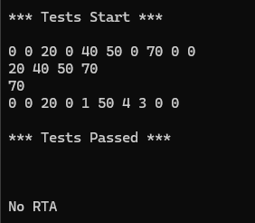

# Sparse Array Implementation using Doubly Linked List

A memory-efficient C++ implementation of sparse arrays using doubly linked lists. This data structure is optimized for arrays where most elements are zero, storing only non-zero values to minimize memory usage.

## Overview

Traditional arrays allocate memory for every element, even if most are zero. This sparse array implementation uses a doubly linked list with sentinel nodes to store only non-zero values, making it highly memory-efficient for scenarios with sparse data.

## Features

- **Memory Efficient**: Only stores non-zero values
- **Fast Access**: O(k) access time where k is the number of non-zero elements before the target index
- **Dynamic Operations**: Support for setting values, getting values, and array addition
- **Sorted Storage**: Elements are maintained in index-sorted order for efficient operations
- **Sentinel Node**: Uses a sentinel node for simplified edge case handling

## Architecture

### Core Components

- **ArrayNode**: Basic node structure containing data, index, and pointers
- **ArrayLinkedList**: Main sparse array class with doubly linked list implementation
- **Sentinel Design**: Head sentinel node simplifies insertion and traversal logic

### Key Methods

- `set_value(data, index)`: Set value at specific index
- `get_value(index)`: Retrieve value at specific index (returns 0 if not stored)
- `add(other_array)`: Add corresponding elements from another sparse array
- `print_array()`: Display complete array including zeros
- `print_array_nonzero()`: Display only non-zero elements

## File Structure

```
├── ArrayNode.h          # Node structure definition
├── SparseArray.h        # Main class declaration
├── SparseArray.cpp      # Implementation details
└── Source.cpp           # Test cases and demonstration
```

## Usage Example

```cpp
#include "SparseArray.h"

// Create sparse array of length 10
ArrayLinkedList array(10);

// Set values at specific indices
array.set_value(50, 5);
array.set_value(20, 2);
array.set_value(70, 7);

// Print full array: 0 0 20 0 0 50 0 70 0 0
array.print_array();

// Print only non-zero values: 20 50 70
array.print_array_nonzero();

// Retrieve specific value
int value = array.get_value(7); // Returns 70
```

## Test Output

The following output demonstrates the sparse array functionality:



The test demonstrates:
1. Creating a sparse array with scattered non-zero values
2. Displaying the complete array representation
3. Showing only non-zero elements
4. Array addition operation combining two sparse arrays

## Time Complexity

- **Set Value**: O(k) where k is the number of stored elements before the target index
- **Get Value**: O(k) where k is the number of stored elements before the target index
- **Add Arrays**: O(n + m) where n and m are the numbers of non-zero elements in each array
- **Print Operations**: O(array_length) for full array, O(k) for non-zero only

## Space Complexity

- **Memory Usage**: O(k) where k is the number of non-zero elements
- **Space Savings**: Significant memory reduction for arrays with high sparsity ratios

## Compilation

```bash
g++ -o sparse_array Source.cpp SparseArray.cpp
./sparse_array
```

## Requirements

- C++11 or later
- Standard library support for `<iostream>` and `<cassert>`

## Use Cases

This sparse array implementation is ideal for:
- Large matrices with mostly zero values
- Scientific computing with sparse data sets
- Memory-constrained environments
- Applications requiring efficient storage of sparse vectors

## Implementation Details

- **Doubly Linked Structure**: Enables efficient bidirectional traversal
- **Index-Based Ordering**: Maintains elements in sorted order by array index
- **Automatic Zero Handling**: Non-stored elements automatically return zero
- **Dynamic Memory Management**: Nodes are created only when needed

## Contributing

This implementation provides a solid foundation for sparse array operations. Potential enhancements could include:
- Iterator support for STL compatibility
- Template-based generic data types
- Additional mathematical operations (subtraction, multiplication)
- Optimized search algorithms for very large sparse arrays
